# Analog-Video-Comb-Filter
Analog Composite Video to S-Video comb filter board using SAA4960, SAA4961 or SAA4963 integrated circuit.

## **WARNING**
**This project uses end-of-life components that are no longer manufactured. If you want to build this, make sure that you can obtain all components before starting. Used or new-old-stock parts can sometimes be found online.**

## Description

This is a fully analog alternative to digital comb filters such as Extron YCS Transcoder or YCS 100. [That doesn't mean it will give better results though](#image-comparison---no-filter-lc-filter-and-comb-filters). I just made it because I didn't find any fully analog device like that on the market and I wanted one.

The comb filter is used to convert a composite video signal into an S-Video (Y/C) signal. Comb filters are much better than passive LC filters usually built into composite video displays, as they can preserve the frequencies of luminance that overlap with chrominance, providing higher image detail while removing dot crawl, and remove those overlapping luminance frequencies from the chrominance signal which reduces color artifacts.

When using the SAA4960 integrated circuit, PAL B, D, G, H and I systems are supported.

SAA4961 provides aditional support for PAL M, N and NTSC M systems.

When using the SAA4963 integrated circuit, only the NTSC M system is supported.

The board is designed to fit inside a KRADEX Z-76 enclosure.

### Circuit description

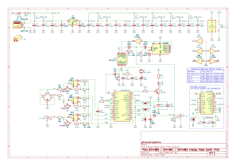

A composite video signal is fed in through an RCA connector (J4). The signal is terminated with a 75 ohm resistor and fed to U3 (or U7), U4 and U6 through 100 nF capacitors.

The LM1881 sync separator (U6) uses the composite video signal to generate a burst gate signal. The burst gate signal passes through a 74HC04 inverter (U5) to the MC44144 subcarrier PLL (U4).

U4 uses the composite video signal and the burst gate signal to generate a subcarrier frequency synchronized to the colorburst of the composite video signal. This subcarrier signal is then passed to the FSC input of U3/U7.

The SAA4960/61/63 comb filter (U3 or U7) is fed with the composite video signal and the synchronized subcarrier signal. The jumpers SYS1 and SYS2 set the video standard, and the jumper LPF can be used to disable the input low-pass filter. This circuit outputs filtered luminance and chrominance signals and a delayed composite video passthrough signal (when using SAA4963, the CVBYP jumper has to be shorted to allow non-delayed composite video passthrough). Those signals are then fed to the output amplifiers.

The AD813 triple op-amp (U2) is used for the output amplifiers. The output signals from the SAA4960/61[^1] are DC-biased by around 1V, so a non-rail-to-rail op-amp like the AD813 is viable. The gain can be adjusted from approx. 1,5x to 2,5x with RV1, RV2 and RV3.

## Pictures

| Assembled rev.2 devices (PAL and NTSC)               | Completed, operating device in enclosure                     |
| ---------------------------------------------------- | ------------------------------------------------------------ |
| 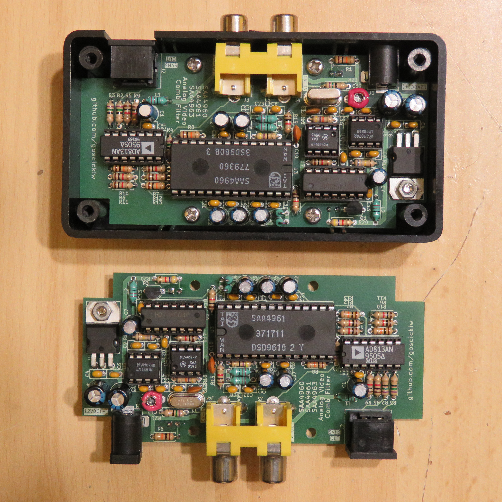 | 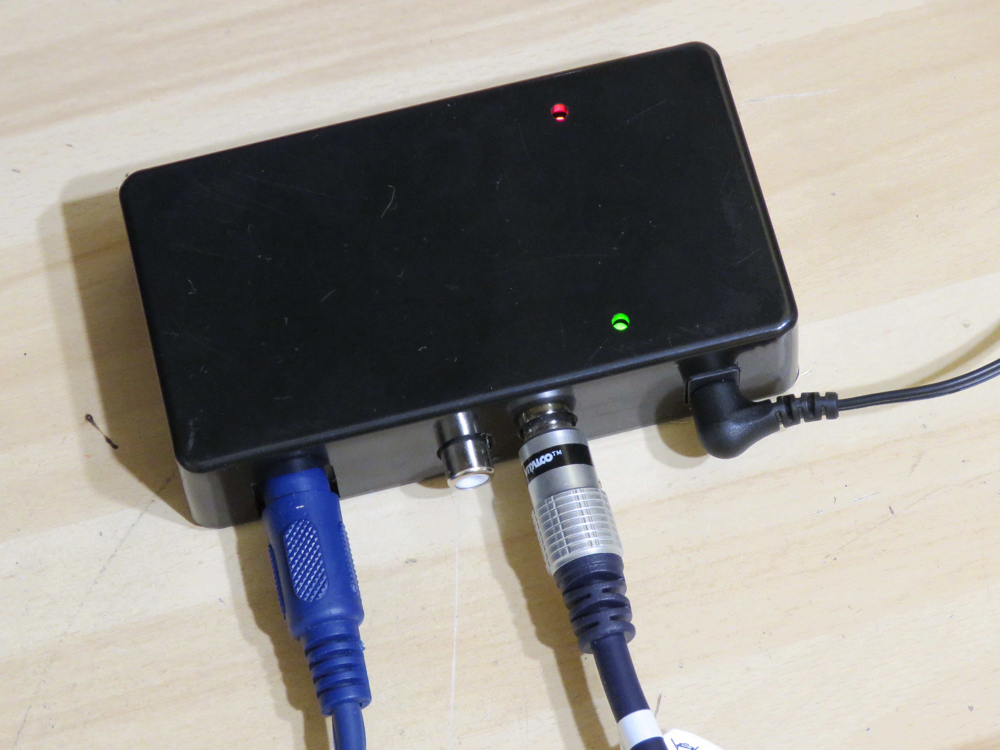 |

### Image comparison - no filter, LC filter and comb filters

<table>
  <tr>
    <th width="50%">No filter</th>
    <th width="50%">LC filter</th>
  </tr>
  <tr>
    <td>Luminance detail is preserved, but dot crawl is visible across the entire picture.</td>
    <td>Dot crawl is mostly removed, but luminance loses some sharpness, and higher frequency luminance components (responsible for sharpness) are left in chrominance causing color artifacts.</td>
  </tr>
  <tr>
    <td></td>
    <td></td>
  </tr>
  <tr>
    <td></td>
    <td></td>
  </tr>
  <tr>
    <th>This analog comb filter</th>
    <th>MC141627 digital comb filter (for comparison, Extron YCS transcoder)</th>
  </tr>
  <tr>
    <td>Dot crawl is mostly removed and luminance sharpness is mostly preserved. Higher frequency luminance components are properly separated from chrominance.</td>
    <td>More effective than the analog comb filter.</td>
  </tr>
  <tr>
    <td></td>
    <td></td>
  </tr>
</table>

  
Monochrome image comparison

  <table>
    <tr>
      <th width="50%">No filter</th>
      <th width="50%">LC filter</th>
    </tr>
    <tr>
      <td>Luminance detail is preserved, but dot crawl is visible in colored sections.</td>
      <td>Dot crawl is mostly removed, but luminance loses some sharpness.</td>
    </tr>
    <tr>
      <td></td>
      <td></td>
    </tr>
    <tr>
      <td></td>
      <td></td>
    </tr>
    <tr>
      <th>This analog comb filter</th>
      <th>MC141627 digital comb filter (for comparison, Extron YCS transcoder)</th>
    </tr>
    <tr>
      <td>Dot crawl is mostly removed and luminance sharpness is mostly preserved.</td>
      <td>More effective than the analog comb filter.</td>
    </tr>
    <tr>
      <td>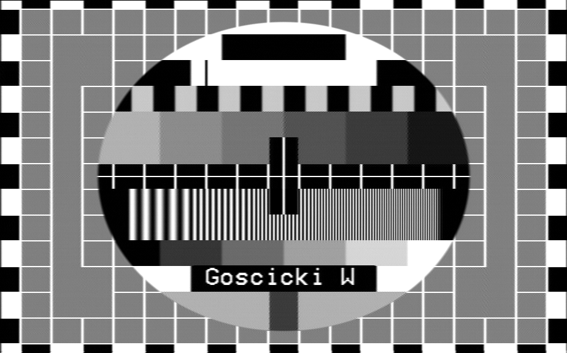</td>
      <td></td>
    </tr>
  </table>

## LEDs

D1 shows that the device is receiving power.

D2 shows that the comb filter is operating (U3 is in COMB mode). I'm not sure if U3 will ever *not* be in COMB mode when used in this circuit, so this LED might be unnecessary. SAA4963 does not have the output needed by this LED, so if it is used, then R19, R20, D2 and Q1 can be left unpopulated.

## REFDL filter capacitors

When using SAA4960 or SAA4961, install C24 and C26, and leave C31 and C32 unpopulated.

When using SAA4963, install C31 and C32, and leave C24 and C26 unpopulated.

## Solder jumper settings

### Standard selection jumpers (SYS1, SYS2)

SAA4961 only. When using SAA4960, SYS1 and SYS2 jumpers should be left open. When using SAA4963, the jumpers are not connected.

Appropriate crystal for the subcarrier oscillator should be installed depending on the jumper setting. If the standard is going to be changed frequently, it may be possible to install a socket for the crystal, however it should be taken into account that MC44144 is sensitive to additional capacitance at the crystal.

| Standard      | SYS1  | SYS2  | Crystal required | 
| ------------- | ----- | ----- | ---------------- |
| PAL B/D/G/H/I | Open  | Open  | 17,734475 MHz    |
| PAL M         | Open  | Short | 14,302444 MHz    |
| PAL N         | Short | Open  | 14,328225 MHz    |
| NTSC M        | Short | Short | 14,31818 MHz     |

### Low pass filter jumper (LPF)

The SAA4960, SAA4961 and SAA4963 integrated circuits have a built-in low-pass filter on the composite video input. With SAA4960 and SAA4961, this filter can be disabled by shorting the LPF jumper, but it's recommended to leave it on. With SAA4963, the jumper is not connected and the filter is always on.

| LPF   | Filter mode     |
| ----- | --------------- |
| Open  | Filter enabled  |
| Short | Filter disabled |

### Composite video passthrough jumper (CVBYP)

SAA4963 doesn't have a composite video output, so the CVBYP jumper was provided for composite video passthrough. When the jumper is shorted, the video signal for composite video output is taken from pin 13 (composite video input) of SAA4963. The DC bias for the output amplifier is provided by the clamping circuit inside SAA4963. Do not install R12 to avoid additional load to the clamping circuit. This configuration has not been tested and may not work correctly. Leave the jumper open if shorting it causes issues for the comb filter.

**WARNING: This jumper must never be shorted if using SAA4960/61.**

| CVBYP | Usage                          |
| ----- | ------------------------------ |
| Open  | When using SAA4960 or SAA4961. |
| Short | When using SAA4963.            |

## Adjustment

After assembly, including setting the jumpers and installing the correct crystal depending on the analog video standard, the variable capacitor C17 will have to be adjusted so that the PLL locks correctly to the color subcarrier and the loop control voltage is centered.

Use the following procedure for adjustment:

1. Connect an EBU (for PAL) or SMPTE (for NTSC) color bar signal from a good quality reference source to the composite video input.
2. Connect a 10x oscillososcope probe to U4 pin 3 (phase detector output loop filter). Use AC coupling, 200 mV/div vertical scale, and 100 µs/div timebase.
3. Here are the reference pictures needed for the following steps:

  
PAL waveforms

  <table>
    <tr>
      <th width="33%">Not locked</th>
      <th width="33%">Locked, not adjusted</th>
      <th width="33%">Best adjustment</th>
    </tr>
    <tr>
      <td>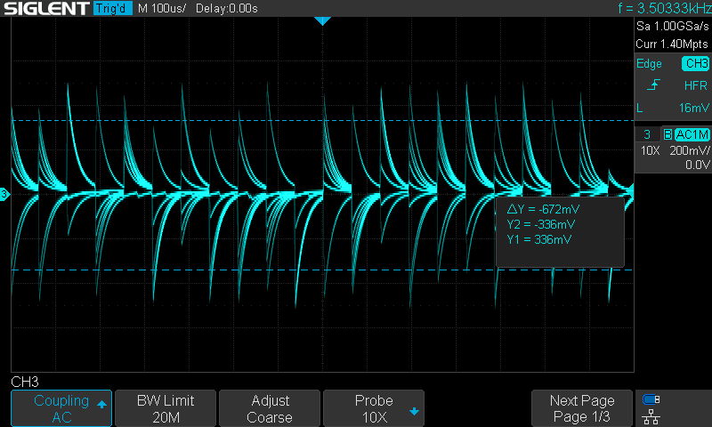</td>
      <td>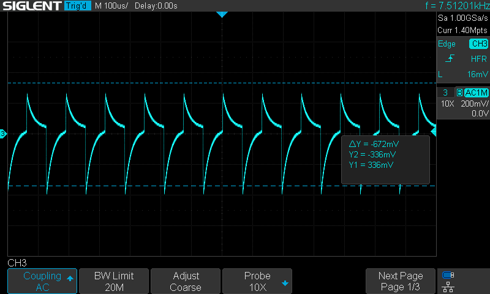 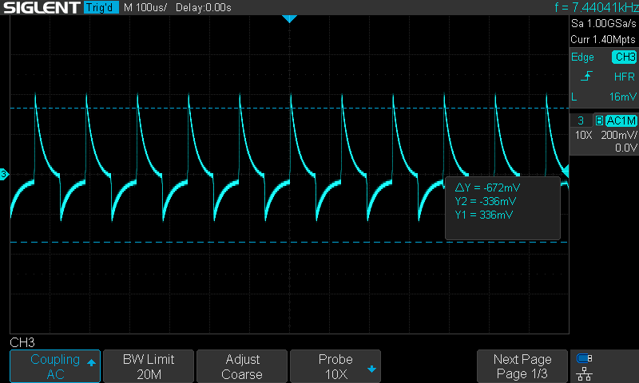</td>
      <td>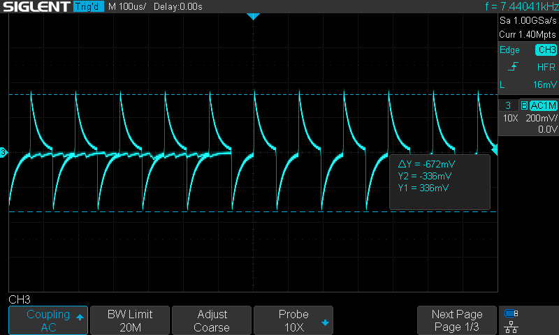</td>
    </tr>
  </table>

  
NTSC waveforms

  <table>
    <tr>
      <th width="33%">Not locked</th>
      <th width="33%">Locked, not adjusted</th>
      <th width="33%">Best adjustment</th>
    </tr>
    <tr>
      <td>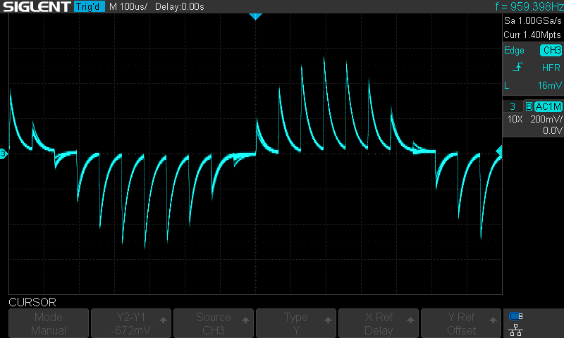</td>
      <td>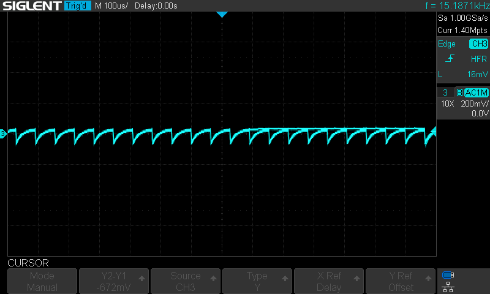 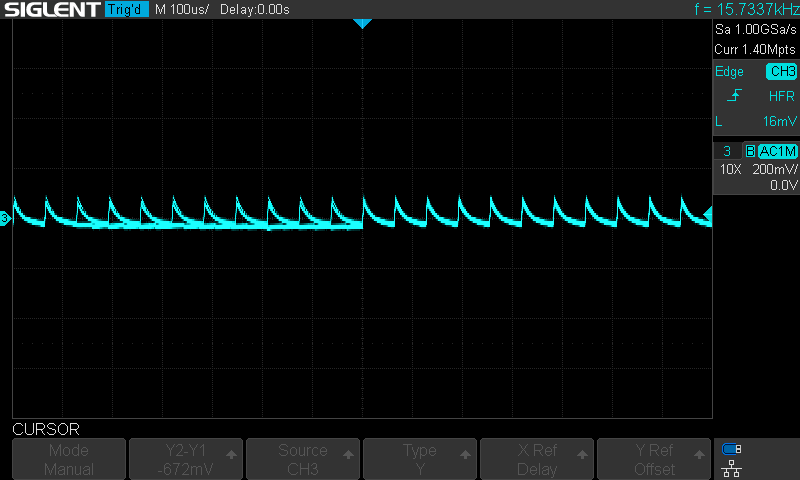</td>
      <td>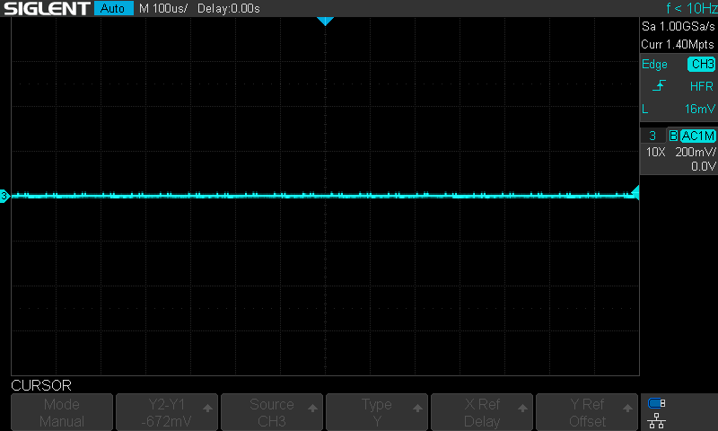</td>
    </tr>
  </table>

4. Follow the flow chart below:

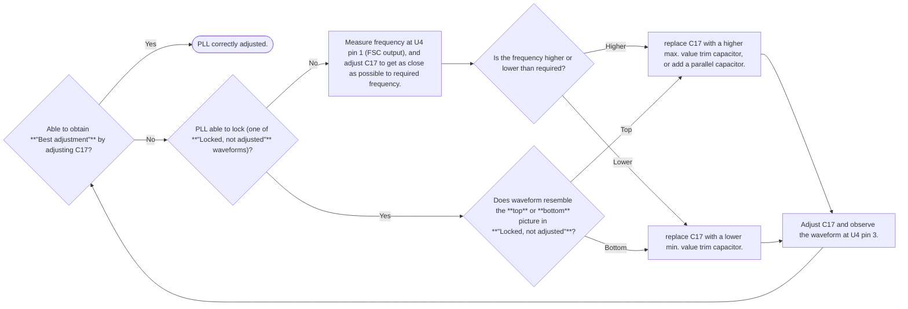

5. Set RV1, RV2, RV3 to center position. Connect the luminance, chrominance and composite outputs to an oscilloscope with 75 ohm load resistance. Luminance signal is preferred for oscilloscope trigger. Adjust RV1, RV2, RV3 to obtain the following:

<table>
  <tr>
    <th>Output</th>
    <th>Adjustment</th>
    <th>Measured value</th>
    <th>PAL</th>
    <th>NTSC</th>
  </tr>
  <tr>
    <td>Chrominance</td>
    <td>RV1</td>
    <td>Peak-peak <b>colorburst</b></td>
    <td>300 mV</td>
    <td>285,72 mV</td>
  </tr>
  <tr>
    <td>Luminance</td>
    <td>RV2</td>
    <td rowspan=2>Peak-peak voltage (sync level to 100% white level)</td>
    <td rowspan=2 colspan=2>1 V</td>
  </tr>
  <tr>
    <td>Composite</td>
    <td>RV3</td>
  </tr>
</table>

Readjustment is necessary if the crystal and the standard selection jumper settings are changed.

## Parts list

### Resistors

| Resistance | Power  | Qty |
| ---------- | ------ | --- |
| 47 Ω       | 0,25 W | 1   |
| 75 Ω       | 0,25 W | 4   |
| 470 Ω      | 0,25 W | 3   |
| 1 kΩ       | 0,25 W | 6   |
| 4,7 kΩ     | 0,25 W | 1   |
| 10 kΩ      | 0,25 W | 4   |
| 47 kΩ      | 0,25 W | 1   |
| 680 kΩ     | 0,25 W | 1   |

### Capacitors

| Capacitance | Pin pitch | Type                       | Qty |
| ----------- | --------- | -------------------------- | --- |
| 4-20 pF     | 5,08 mm   | Ceramic variable           | 1   |
| 470 pF      | 2,5 mm    | Ceramic                    | 1   |
| 1 nF        | 5 mm      | Ceramic                    | 1   |
| 100 nF      | 2,5 mm    | Ceramic                    | 18  |
| 100 μF      | 2 mm      | Electrolytic, ≥6,3V, ⌀5mm  | 6   |
| 100 μF      | 2 mm      | Electrolytic, ≥16V, ⌀5mm   | 1   |
| 220 μF      | 2,5 mm    | Electrolytic, ≥16V, ⌀6,3mm | 2   |

### Inductors

| Inductance | Max. Current | Exact part        | Qty |
| ---------- | ------------ | ----------------- | --- |
| 22 μH      | 0,285 A      | Ferrocore DLA22-N | 6   |

### Semiconductors

| Type           | Model     | Qty |
| -------------- | --------- | --- |
| LED            | 3mm Green | 1   |
| LED            | 3mm Red   | 1   |
| NPN Transistor | BC548     | 1   |

### Integrated circuits

| Model                         | Package                               | Qty |
| ----------------------------- | ------------------------------------- | --- |
| L7805                         | TO220                                 | 1   |
| AD813 or AD8044               | DIP14                                 | 1   |
| SAA4960 or SAA4961 or SAA4963 | DIP28 (SAA4960/61) or DIP20 (SAA4963) | 1   |
| MC44144                       | DIP8                                  | 1   |
| 74HC04                        | DIP14                                 | 1   |
| LM1881                        | DIP8                                  | 1   |

### Other

| Type               | Model                           | Qty |
| ------------------ | ------------------------------- | --- |
| Potentiometer      | PIHER PT10LH-1K                 | 3   |
| Crystal            | HC-49U, depends on video system | 1   |
| RCA Connector      | Keystone Electronics 973        | 2   |
| Mini-DIN Connector | MDC-204, unshielded             | 1   |
| DC Barrel Jack     | Generic 5,5/2,5mm               | 1   |
| Enclosure          | KRADEX Z-76                     | 1   |

## License

This work is licensed under CC BY-SA 4.0 license.

[^1]: SAA4963 has not been tested as I don't have one yet.
