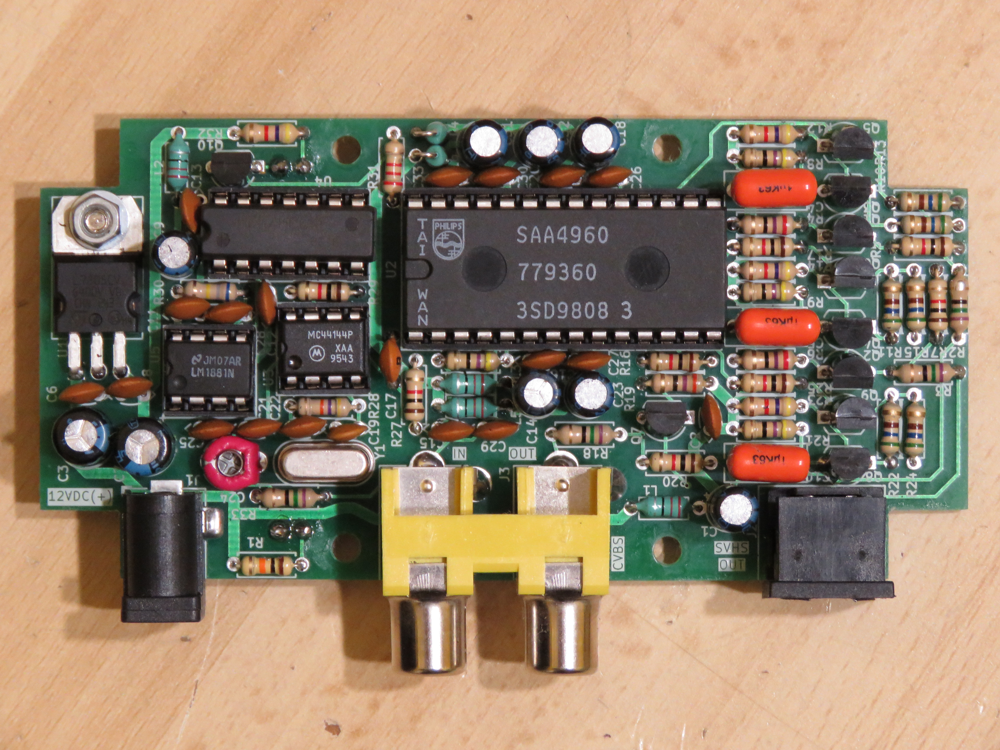
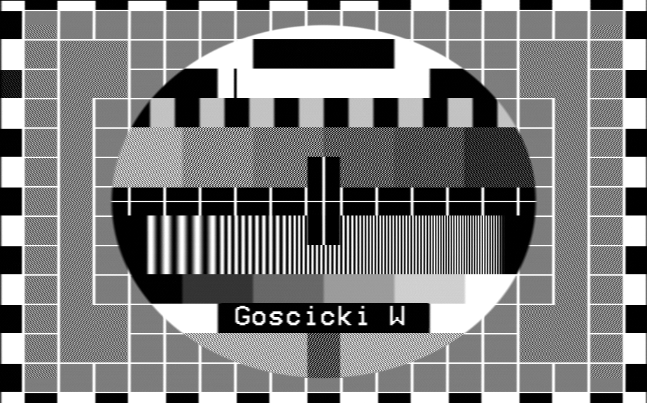
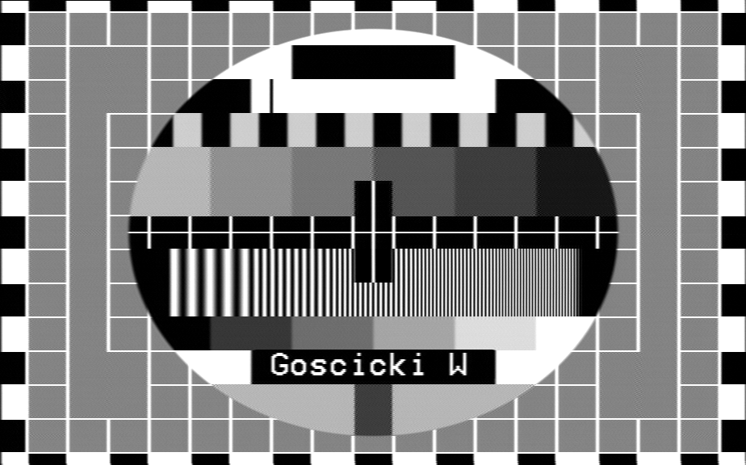
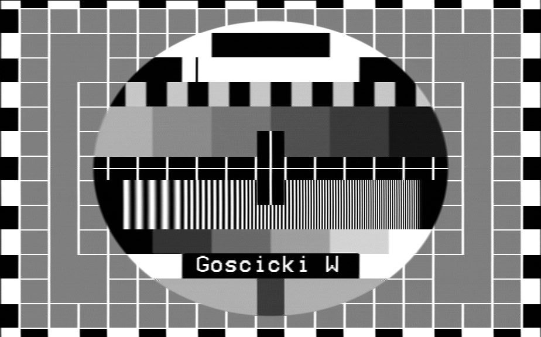
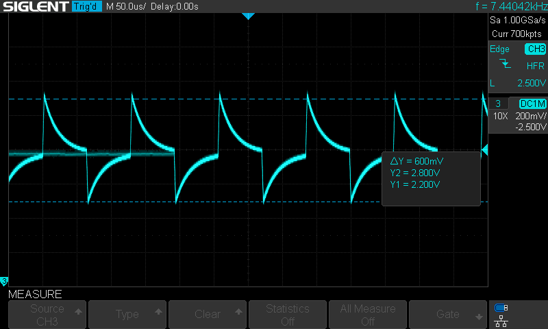
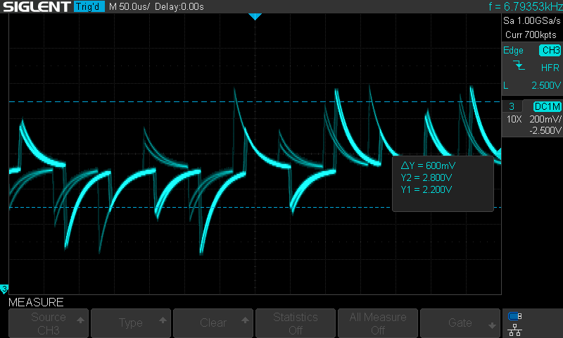

# Analog-Video-Comb-Filter
Analog Composite Video to S-Video comb filter board using SAA4960, SAA4961 or SAA4963 integrated circuit

## **WARNING**
**This project uses end-of-life components that are no longer manufactured. If you want to build this, make sure that you can obtain all components before starting. Used or new-old-stock parts can sometimes be found online.**

## Description

This is a fully analog alternative to digital comb filters such as Extron YCS Transcoder or YCS 100. [That doesn't mean it will give better results though](#image-comparison-on-a-monochrome-display---no-filter-lc-filter-and-comb-filters). I just made it because I didn't find any fully analog device like that on the market and I wanted one.

The comb filter is used to convert a composite video signal into an S-Video (Y/C) signal. Comb filters are much better than passive LC filters usually built into composite video displays, as they can preserve the frequencies of luminance that overlap with chrominance, providing higher image detail while removing dot crawl, and remove those overlapping luminance frequencies from the chrominance signal which reduces color artifacts.

When using the SAA4960 integrated circuit, PAL B, D, G, H and I systems are supported.

SAA4961 provides aditional support for PAL M, N and NTSC M systems.

When using the SAA4963 integrated circuit, only the NTSC M system is supported.

The board is designed to fit inside a KRADEX Z-76 enclosure.

### Circuit description

A composite video signal is fed in through an RCA connector. The signal is terminated with a 75 ohm resistor and fed to U2 (or U6), U3 and U5 through 100 nF capacitors.

The LM1881 sync separator (U5) uses the composite video signal to generate a burst gate signal. The burst gate signal passes through a 74HC04 inverter (U4) to the MC44144 subcarrier PLL (U3).

U3 uses the composite video signal and the burst gate signal to generate a subcarrier frequency synchronized to the colorburst of the composite video signal. This subcarrier signal is then passed to the FSC input of U2/U6.

The SAA4960/61/63 comb filter (U2 or U6) is fed with the composite video signal and the synchronized subcarrier signal. The jumpers SYS1 and SYS2 set the video standard, and the jumper LPF can be used to disable the input low-pass filter. This circuit outputs filtered luminance and chrominance signals and a delayed composite video passthrough signal (when using SAA4963, the CVBYP jumper has to be shorted to allow composite video passthrough). Those signals are then fed to the output amplifiers built using bipolar transistors.

Each output amplifier is built from two BC548 NPN transistors and a BC558 PNP transistor. The output signals from the SAA4960/61 are DC-biased by around 1V, so DC decoupling capacitors are not required to properly DC-bias the base of the transistors. This allows the signal blanking level to stay at the same voltage regardless of what is being displayed.

## Pictures

| Assembled prototype                                             | Completed, operating device in enclosure                     |
| --------------------------------------------------------------- | ------------------------------------------------------------ |
|  |  |

### Image comparison on a monochrome display - no filter, LC filter and comb filters

| No filter                                                              | LC filter                                                               |
| ---------------------------------------------------------------------- | ----------------------------------------------------------------------- |
| luminance detail is preserved, but dot crawl is visible.               | Dot crawl is mostly removed, but luminance loses some sharpness.        |
|                     |                      |

| Analog comb filter                                                     | Digital comb filter (for comparison)                                    |
| ---------------------------------------------------------------------- | ----------------------------------------------------------------------- |
| Dot crawl is mostly removed and luminance sharpness is preserved.      | More effective at removing dot crawl than the analog comb filter.       |
|   |  |

## LEDs

D1 shows that the device is receiving power.

D2 shows that the comb filter is operating (U2 is in COMB mode). I'm not sure if U2 will ever *not* be in COMB mode when used in this circuit, so this LED might be unnecessary. SAA4963 does not have the output needed by this LED, so if it is used, then R30, Q10, D2 and R32 can be left unpopulated.

## REFDL filter capacitors

When using SAA4960 or SAA4961, install C28 and C30, and leave C34 and C35 unpopulated.

When using SAA4963, install C34 and C35, and leave C28 and C30 unpopulated.

## Solder jumper settings

### Standard selection jumpers (SYS1, SYS2)

SAA4961 only. When using SAA4960, SYS1 and SYS2 jumpers should be left open. When using SAA4963, the jumpers are not connected.

Appropriate crystal for the subcarrier oscillator should be installed depending on the jumper setting. If the standard is going to be changed frequently, it may be possible to install a socket for the crystal, however it should be taken into account that MC44144 is sensitive to additional capacitance at the crystal.

| Standard      | SYS1  | SYS2  | Crystal required | 
| ------------- | ----- | ----- | ---------------- |
| PAL B/D/G/H/I | Open  | Open  | 17,734475 MHz    |
| PAL M         | Open  | Short | 14,302444 MHz    |
| PAL N         | Short | Open  | 14,328225 MHz    |
| NTSC M        | Short | Short | 14,31818 MHz     |

### Low pass filter jumper (LPF)

The SAA4960, SAA4961 and SAA4963 integrated circuits have a built-in low-pass filter on the composite video input. With SAA4960 and SAA4961, this filter can be disabled by shorting the LPF jumper, but it's recommended to leave it on. With SAA4963, the jumper is not connected and the filter is always on.

| LPF   | Filter mode     |
| ----- | --------------- |
| Open  | Filter enabled  |
| Short | Filter disabled |

### Composite video passthrough jumper (CVBYP)

SAA4963 doesn't have a composite video output, so the CVBYP jumper was provided for composite video passthrough. When the jumper is shorted, the video signal for Q9 is taken from the composite video input of SAA4963. The DC bias is provided by the clamping circuit inside SAA4963. It may be necessary to use a larger value R25 resistor to reduce the load on the clamping circuit. This configuration has not been tested and may not work correctly. Leave the jumper open if shorting it causes issues for the comb filter.

| CVBYP | Usage                          |
| ----- | ------------------------------ |
| Open  | When using SAA4960 or SAA4961. |
| Short | When using SAA4963.            |

## Adjustment

After assembly, including setting the jumpers and installing the correct crystal depending on the analog video standard, the variable capacitor C21 will have to be adjusted so that MC44144 properly locks onto the subcarrier. Use the following procedure for adjustment:

1. Connect an EBU (for PAL) or SMPTE (for NTSC) color bar signal source to the composite video input.
2. Connect an oscilloscope probe, preferably in 10x mode for higher impedance, to U3 pin 3 (phase detector output loop filter).
3. Adjust C24 until a stable beat waveform[^1] (pictured below) with 2.5 V DC offset is obtained. When this is achieved, the PLL is correctly adjusted.
4. If C24 has no position where the voltage is stable, measure the frequency at U3 pin 1 (FSC output).
5. If the maximum frequency you can obtain by adjusting C24 is lower than the correct subcarrier frequency, replace C24 with a lower minimum value variable capacitor, then go back to step 3.
6. If the minimum frequency is higher than the correct subcarrier frequency, replace C24 with a higher maximum value variable capacitor, or add additional capacitance in parallel, then go back to step 3.

C21 will have to be readjusted if the crystal and the standard selection jumper settings are changed.

| Correctly adjusted, locked                                                 | Incorrectly adjusted, not locked                                            |
| -------------------------------------------------------------------------- | --------------------------------------------------------------------------- |
|  |  |

[^1]: I So far I have only tested it with PAL, but presumably with NTSC this waveform would instead appear as a stable DC voltage, due to NTSC not using a swinging burst.

## Known issues

1. If the device connected to an output has the load resistor connected through a capacitor (such configuration is present in PVM-1454QM chrominance input for example), then the signal can become malformed. I am planning to redesign the output circuit to resolve this.

## Parts list

### Resistors

| Resistance | Power  | Qty |
| ---------- | ------ | --- |
| 27 Ω       | 0,25 W | 3   |
| 47 Ω       | 0,25 W | 4   |
| 75 Ω       | 0,25 W | 4   |
| 560 Ω      | 0,25 W | 6   |
| 1 kΩ       | 0,25 W | 8   |
| 2,2 kΩ     | 0,25 W | 1   |
| 4,7 kΩ     | 0,25 W | 4   |
| 10 kΩ      | 0,25 W | 1   |
| 47 kΩ      | 0,25 W | 1   |
| 680 kΩ     | 0,25 W | 1   |

### Ceramic and MLCC capacitors 

| Capacitance | Pin pitch | Type             | Qty |
| ----------- | --------- | ---------------- | --- |
| 4-20 pF     | 5,08 mm   | Ceramic variable | 1   |
| 470 pF      | 2,5 mm    | Ceramic          | 1   |
| 1 nF        | 5 mm      | Ceramic          | 1   |
| 100 nF      | 2,5 mm    | Ceramic          | 18  |
| 1 μF        | 7,5 mm    | MLCC             | 3   |

### Electrolytic capacitors

| Capacitance | Voltage | Pin pitch | Diameter | Qty |
| ----------- | ------- | --------- | -------- | --- |
| 100 μF      | ≥ 6,3 V | 2 mm      | 5 mm     | 6   |
| 100 μF      | ≥ 16 V  | 2 mm      | 5 mm     | 1   |
| 220 μF      | ≥ 16 V  | 2,5 mm    | 6,3 mm   | 2   |

### Inductors

| Inductance | Max. Current | Exact part        | Qty |
| ---------- | ------------ | ----------------- | --- |
| 22 μH      | 0,285 A      | Ferrocore DLA22-N | 6   |

### Semiconductors

| Type           | Model     | Qty |
| -------------- | --------- | --- |
| LED            | 3mm Green | 1   |
| LED            | 3mm Red   | 1   |
| NPN Transistor | BC548     | 7   |
| PNP Transistor | BC558     | 3   |

### Integrated circuits

| Model                         | Package                               | Qty |
| ----------------------------- | ------------------------------------- | --- |
| L7805                         | TO220                                 | 1   |
| SAA4960 or SAA4961 or SAA4963 | DIP28 (SAA4960/61) or DIP20 (SAA4963) | 1   |
| MC44144                       | DIP8                                  | 1   |
| 74HC04                        | DIP14                                 | 1   |
| LM1881                        | DIP8                                  | 1   |

### Other

| Type               | Model                           | Qty |
| ------------------ | ------------------------------- | --- |
| Crystal            | HC-49U, depends on video system | 1   |
| RCA Connector      | Keystone Electronics 973        | 2   |
| Mini-DIN Connector | MDC-204, unshielded             | 1   |
| DC Barrel Jack     | Generic 5,5/2,5mm               | 1   |
| Enclosure          | KRADEX Z-76                     | 1   |

## License

This work is licensed under CC BY-SA 4.0 license.
